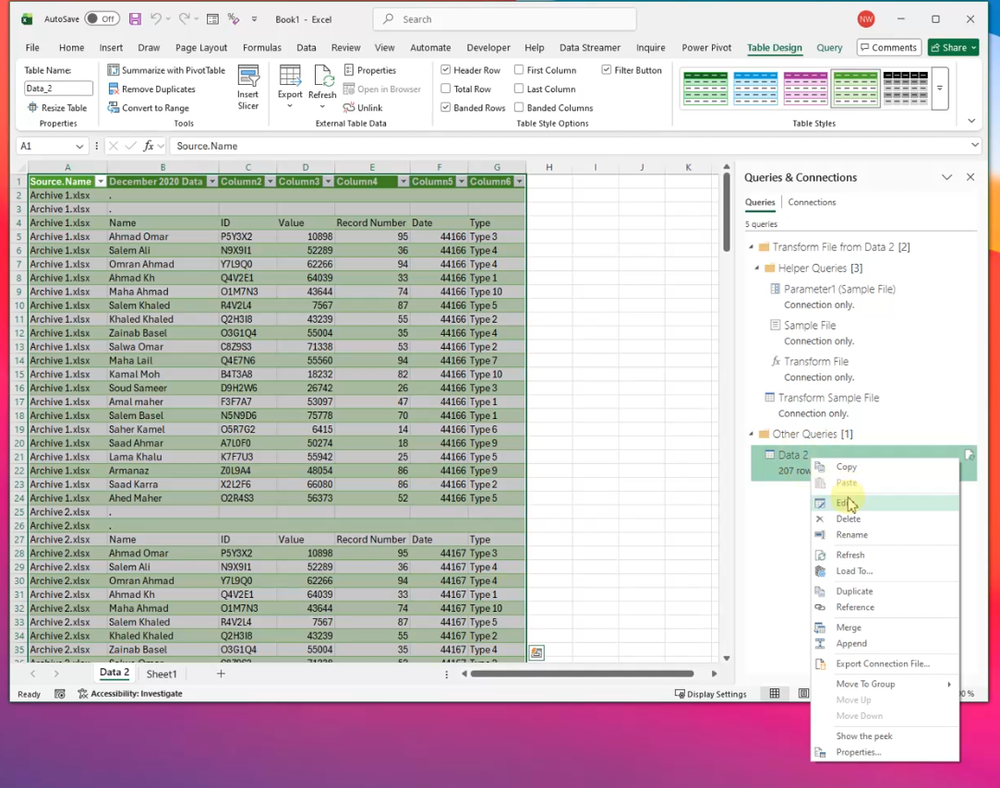

# 📊 Fusion de Tableaux Excel depuis Plusieurs Fichiers avec Power Query

> **Objectif :** Combiner automatiquement des données provenant de plusieurs fichiers Excel en un seul tableau propre, en résolvant les problèmes courants liés aux en-têtes et aux lignes parasites.

---

## 📁 Structure du Dossier Source

Le dossier contient plusieurs fichiers Excel (Archive 1, Archive 2, … Archive 9), chacun avec les mêmes colonnes :

| Colonne | Description |
|---|---|
| Name | Nom de la personne |
| ID | Identifiant unique |
| Value | Valeur numérique |
| Record Number | Numéro d'enregistrement |
| Date | Date de l'entrée |
| Type | Catégorie (Type 1 à Type 10) |


---

## ⚠️ Problème : Données Brutes Après Fusion

Lors d'une fusion directe via **Get Data → From Folder**, Power Query importe tous les fichiers mais **sans traitement**, ce qui donne un résultat mal structuré :

- Les **lignes d'en-tête** de chaque fichier apparaissent comme des données normales
- Des **lignes vides** ou parasites se glissent en début de tableau
- Les **colonnes portent des noms génériques** (Column1, Column2, …) au lieu des vrais en-têtes


---

## 🛠️ Solution Étape par Étape avec Power Query

### Étape 1 — Importer depuis un Dossier

Dans Excel : **Données → Obtenir des données → À partir d'un fichier → À partir d'un dossier**

Sélectionnez le dossier contenant tous vos fichiers Archive.


---

### Étape 2 — Modifier la Requête dans Power Query

Dans la fenêtre de prévisualisation, cliquez sur **Modifier** (ou **Edit**) pour ouvrir le Power Query Editor.



---

### Étape 3 — Corriger le Fichier Sample (Transform Sample File)

Power Query utilise un **fichier sample** pour définir la transformation appliquée à tous les fichiers du dossier. C'est ici que se fait la vraie correction.

Cliquez sur **Transform Sample File** dans le panneau gauche des requêtes.


Le fichier se présente comme suit — avec 2 lignes parasites en haut avant les vrais en-têtes :


#### 3a — Supprimer les Lignes du Haut

Allez dans **Home → Remove Rows → Remove Top Rows**


Dans la boîte de dialogue, entrez **2** (le nombre de lignes à supprimer avant les vrais en-têtes).


#### 3b — Utiliser la Première Ligne comme En-Têtes

Après suppression, la première ligne contient les vrais noms de colonnes. Appliquez **Use First Row as Headers** :

> **Transform → Use First Row as Headers**

---

### Étape 4 — Détecter les Types de Données

Une fois les en-têtes corrects, laissez Power Query identifier les types automatiquement :

> **Transform → Detect Data Type**


---

### Étape 5 — Résoudre l'Erreur « Column Not Found »

Après les corrections du Sample File, il peut apparaître une erreur dans la requête principale **Data 2** :

```
Expression.Error: The column 'December 2020 Data' of the table wasn't found.
```

Cette erreur survient parce que Power Query avait **mémorisé un ancien nom de colonne** (le titre du fichier Excel, par exemple "December 2020 Data") qui n'existe plus après la correction des en-têtes.


**Solution :** Supprimez l'étape **Changed Type** dans les Applied Steps (panneau droit), ou modifiez manuellement la formule M pour référencer les bons noms de colonnes.

---

## ⚡ Point Important : Sensibilité à la Casse des En-Têtes

> **La fusion s'effectue sur la base des noms de colonnes — la casse (majuscules/minuscules) est prise en compte.**

Si un fichier a une colonne `Name` et un autre `name` ou `NAME`, Power Query les traitera comme **des colonnes différentes**, ce qui créera des colonnes dupliquées dans le résultat final.

✅ **Vérifiez que tous vos fichiers ont exactement les mêmes noms de colonnes avant la fusion.**

---

### Étape 6 — Résultat Final : Données Propres

Après toutes les corrections, la requête **Data 2** affiche 180 lignes propres avec les bons en-têtes, sans lignes parasites.


---

### Étape 7 — Fermer et Charger

Une fois satisfait du résultat dans Power Query Editor :

> **File → Close & Load**


Les données fusionnées sont chargées dans une nouvelle feuille Excel sous forme de tableau structuré.

---

## 📋 Récapitulatif des Étapes

```
1. Données → Obtenir les données → À partir d'un dossier
2. Modifier la requête dans Power Query Editor
3. Ouvrir "Transform Sample File"
   a. Supprimer les lignes du haut (Remove Top Rows → 2)
   b. Promouvoir les en-têtes (Use First Row as Headers)
4. Détecter les types (Detect Data Type)
5. Corriger l'erreur "column not found" si elle apparaît
6. Vérifier la cohérence des noms de colonnes (casse identique)
7. Fermer et charger (Close & Load)
```

---

## 🧰 Outils Utilisés

- **Microsoft Excel** (avec Power Query intégré)
- **Power Query Editor** — transformation et nettoyage des données

---

## 👤 Auteur

**WalidDataLab** — Projets de data analytics et visualisation  
🔗 [github.com/WalidDataLab](https://github.com/WalidDataLab)
